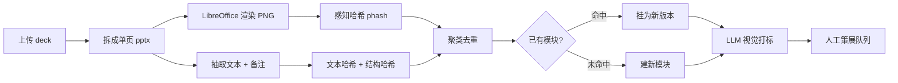
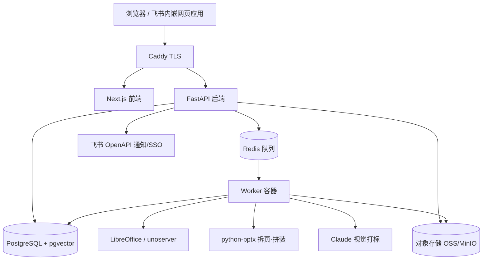

# SlideHub · PPT 模块化管理工作台 — 产品与技术方案

> 状态：方案草案 v1，待确认关键决策点后进入开发
> 适用：PR / 咨询类公司的对外提案 deck 资产管理

---

## 1. 一句话定义

把公司散落在每个人手里的 PPT，**拆到「页」这个粒度**入库、去重、打标签，
之后所有对外提案都由「挑页 → 拼装 → 导出」产生；导出的 deck 改完能**回传**，
改动的页作为**新版本**沉淀回库里，供下次挑选。

不是一个网盘，不是一个 PPT 编辑器。是一个**幻灯片资产库 + 拼装器 + 版本控制**。

---

## 2. 关键认知：三个转变

这个项目能不能成，取决于是否接受下面三件事。

### 2.1 原子单位是「页」，不是「文件」

今天的痛点（打开超大 deck 一页页删）本质是：**知识的存储单位是 deck，但使用单位是页**。
入库时就把 deck 炸成页，痛点自动消失 —— 不再有「删页」这个动作，只有「选页」。

### 2.2 「页」不等于「文件里的那一张」

同一页《公司简介》在 34 份 deck 里有 34 个物理副本，其中可能只有 5 个是真的不同。
所以要引入两层概念：

- **模块 Module（逻辑页）**：一个语义单元，比如「公司简介-一句话定位」
- **版本 Version（物理页）**：这个模块的某个具体实现，比如「2025Q3 数据版」「英文版」「极简版」

入库时靠指纹自动聚类，把 34 个物理副本收敛成 5 个版本挂在 1 个模块下。
**这一步的产出报告本身就是价值**：「你们有 34 份 deck、2100 页，实际只有约 480 个独立模块」。

### 2.3 系统会不会变成垃圾场，取决于「策展」

自动入库只能做到 70%。必须有一个显式的 **策展（Curation）** 环节：
由 1-2 个内容负责人为每个模块**指定主版本、补标签、废弃旧页**。

这一步必须做成产品里的一等公民（带进度条的任务队列：「480 个模块，已策展 120 个」），
而不是「大家有空整理一下」。**没有策展的资产库 = 换了个地方的共享盘。**

---

## 3. 领域模型

```
SourceDeck  上传的原始 deck（不可变，永久留档，可回溯）
   │  ingest：拆页 / 渲染 / 指纹 / 打标
   ▼
Module  逻辑页（1 个语义单元）
   ├─ facets：板块 / 行业 / 客户 / 语言 / 密级 / 类型 …
   ├─ default_version：主推版本
   └─ Version[]  物理页（自包含单页 pptx + 缩略图 + 文本 + 指纹 + 血缘）
                    └─ parent_version：从哪个版本改来的

Recipe  配方 = 有序的 (module, version) 列表 + 板块分隔 + 变量
   ├─ 可存为 Playbook（剧本）：「标准新客提案 60 页」「快消行业版」
   ▼
Export  一次导出（记录配方快照 + 客户 + 时间 + 导出人 + 页面水印 ID）
   ▼  客户汇报后修改
Reimport  回传 → 识别 → diff → 决策（忽略 / 新版本 / 覆盖 / 新模块）→ 回到 Module
```

四张核心概念表：`Module`、`Version`、`Recipe`、`Export`。其余都是它们的附属。

---

## 4. 四条主线工作流

### 4.1 入库（Ingest）



每一页最终产出：
- **自包含的单页 .pptx**（含它的 layout / master / 媒体）—— 让拼装变成纯粹的「合并 N 个单页文件」
- **缩略图 PNG + 全页 PDF**
- **文本内容 + 演讲者备注**（全文检索用）
- **指纹四件套**：文本哈希、感知哈希、结构哈希、媒体 sha256
- **向量 embedding**（语义检索用）

### 4.2 检索（Library）

分面筛选（左侧多选）+ 关键词 + 语义搜索，网格式缩略图。
每张卡片显示：标题、板块、行业、最近使用时间、被用次数、版本数、密级标记。

### 4.3 拼装（Builder）

左右双栏：左边是筛选后的页库，右边是正在拼的 deck（拖拽排序、板块可折叠）。

必须有的能力：
- **从剧本起步**：选行业 + 客户类型 + 目标页数 → 自动铺一版初稿，再增删
- **规则校验**：封面必须首页 / 每板块前插过渡页 / 对外版本禁止含「内部限用」页 / 案例页缺 logo 授权提醒
- **变量替换**：`{{客户名}}` `{{日期}}` `{{提案标题}}` + 客户 logo 占位替换
- **实时页数 + 预估讲述时长**
- **导出**：PPTX + PDF，自动重编页码、重生成目录页、埋入页面标记

### 4.4 回传（Round-trip）

导出的每一页都埋了不可见标记。回传时系统逐页识别 → 生成 diff → 人工决策：

| 情况 | 决策选项 |
|---|---|
| 内容没变 | 忽略 |
| 内容有改动 | **存为该模块的新版本**（可选是否设为主版本）／ 覆盖当前版本（需权限） |
| 全新的页 | 作为新模块入库，进打标流程 |
| 导出时有、回传时没了 | 记为「被删」信号，计入该模块的**留存率** |

最后那条是个被低估的金矿：**跨多次导出统计每一页的留存率**，
就能知道哪些页真的进了客户视野、哪些页每次都被删 —— 这是内容策略的直接输入。

---

## 5. 标签体系：分面，不是树

一页 PPT 天然属于多个维度，用单一树形分类一定会打架。用**分面（faceted）**：

| 分面 | 取值示例 | 说明 |
|---|---|---|
| `section` 板块 | 公司介绍 / 公司服务 / 行业案例 / 资源 | 你已有的四大板块，做一级导航 |
| `subsection` 子板块 | 关于我们·团队·里程碑·客户墙 ／ 媒体关系·内容营销·危机公关·KOL | 每个板块下 5-10 个 |
| `industry` 行业 | 消费电子 / 美妆 / 汽车 / 快消 / 金融 / 医疗 / 游戏 / B2B | 案例页的主检索维度 |
| `client` 客户 | 具体客户名 | 与密级强相关 |
| `market` 市场 | 中国大陆 / 港澳台 / 东南亚 / 北美 / 全球 | |
| `language` 语言 | 中文 / 英文 / 中英双语 | 变体的主要来源之一 |
| `slide_type` 页型 | 封面 / 目录 / 过渡 / 正文 / 数据 / 案例 / 团队 / 报价 / 结尾 | 拼装规则引擎靠它 |
| `sensitivity` 密级 | 可对外 / 需脱敏 / 内部限用 | **最重要的一个字段** |
| `data_asof` 数据时点 | 2025-09 | 案例数据会过期，用于「陈旧提醒」 |
| `status` 状态 | 草稿 / 待审 / 已批准 / 已弃用 | 只有「已批准」能进对外导出 |

**密级字段单独强调**：案例页里全是客户名、效果数据、有时还有报价。
一旦拼装时误选，就是把 A 客户的东西发给 B 客户。导出前必须有强制拦截。

**打标流程**：渲染图 + 文本 + 备注 → 视觉模型 → 返回 JSON（各分面建议值 + 一句话用途描述 + 置信度）
→ 低置信度进人工队列。所有标签记录 `source: auto | human`，人工改过的不再被自动覆盖。

---

## 6. 版本控制模型

关键区分 —— 你说的「保留多个版本供未来选择」其实是**两件事**：

- **变体（Variant）**：并列共存，拼装时二选一。中文版 vs 英文版、详版 vs 极简版、2024 数据版 vs 2025 数据版
- **修订（Revision）**：时间线，后者取代前者，用于审计和回滚

MVP 用**扁平版本 + 父指针**同时覆盖这两种：

```
Module「案例-某新能源车企-传播效果」
├── v1  2024 原始版           status: deprecated
├── v2  2025Q1 数据更新       parent: v1   status: approved   ★ 主版本
│   └── v4  英文版            parent: v2   status: approved
└── v3  极简一页版            parent: v1   status: approved
```

- 每个版本有：`label`（人写的、说人话的名字）、`parent_version_id`（血缘）、`status`、`创建人/时间`
- 模块有一个 `default_version_id`（主版本），拼装时默认选它，可手动切
- UI 上就是一棵**版本树 + 缩略图并排对比**

不要用 git 的 branch/merge 心智 —— PPT 页没法自动 merge，人也不需要。
需要的是「并排看，选一个」。

---

## 7. 难点一：回传识别（怎么知道这页是从哪来的）

这是整个系统的技术命门。用**三重保险**，逐级降级：

### 第一重：不可见标记形状（主）
在每页插入一个**画布外**（x = -10000000 EMU）、无填充无边框的空形状，
把 ID 写在它的 **shape name** 里：`PPTHUB:{module_id}:{version_id}:{export_id}`

- 为什么用 shape name 而不是文本框：PowerPoint 稳定保留 shape name，且不出现在任何可见位置、不进大纲、不影响放映
- 抗得住：重排页序、复制粘贴页、改文字、换图、另存为

### 第二重：deck 级 manifest（辅）
把「本次导出的完整配方」写进 PPTX 的**自定义 XML part**。
即使某页的标记被清掉，也知道这份文件属于哪次导出、原本有哪些页。

### 第三重：指纹兜底（保底）
标记全丢时，用 phash + 文本相似度到全库里找最近邻，给出候选让人确认：
「这页认不出来了 —— 是新页，还是改自《XXX》？」

### 回传比对 UI
三栏对照：**原版本缩略图 | 回传版本缩略图 | 文本级 diff**，一页一个决策按钮。
支持「全部忽略未变更页」一键处理，让人只看真正改过的那几页。

---

## 8. 难点二：拼装保真度

跨 deck 抽页拼接，最容易出问题的是：母版/版式丢失、字体替换、图表变形、SmartArt 崩坏。

### 应对策略（组合拳）

**① Phase 0 必须先做技术验证（1 周，不写 UI）**
拿 3 份真实 deck，跑通「拆页 → 跨 deck 拼 10 页 → PowerPoint 打开肉眼验收」。
这一步的结果决定后面所有技术选型。**验不过就不要往下建 UI。**

**② 模板归一化（推荐主路线）**
入库时把所有页「重挂」到公司统一母版上。
所有页共享同一套 layout/theme 后，跨 deck 拼接的风险几乎消失。
副作用是个业务红利：**顺手把飘了三年的模板统一了**。

**③ 自动保真度回归测试（关键的信任机制）**
导出后把成品渲染成 PDF，逐页与入库时存的该页缩略图做 phash 比对，
超过阈值就标黄告警「第 17 页可能有渲染差异，请人工确认」。

> 这里有个巧妙点：比对的是 *LibreOffice 渲染的源页* vs *LibreOffice 渲染的成品页*，
> 渲染器本身的不准会在两边**相互抵消**，所以这个检测是可靠的。

**④ 两个逃生舱**
- **源保真模式**：若某一整块页都来自同一份源 deck，就走「复制源文件 + 删页」路线，零风险
- **手工维护标记**：任何模块可标记为「原样插入，不做任何处理」

**⑤ 字体**
渲染容器里必须装齐公司在用的中文字体（思源黑体 / 微软雅黑 / 方正系列等），
否则缩略图全是豆腐块。导出时提供「嵌入字体」选项。

**⑥ 兜底商业方案**
如果开源路线（python-pptx 自研 clone）保真度实测不达标，
商业库 Aspose.Slides 的 `AddClone()` 能正确处理母版/版式/主题，约 $1k+/年。
**先按开源做，把这个当预案。**

---

## 9. 技术架构

### 9.1 选型

| 层 | 选择 | 理由 |
|---|---|---|
| 前端 | Next.js + TypeScript + Tailwind + shadcn/ui + dnd-kit | 拖拽拼装体验；生态成熟，vibe coding 友好 |
| 后端 | **Python + FastAPI** | 所有 PPTX 处理都在 Python 生态（python-pptx / Pillow / imagehash），不要跨语言拆 |
| 异步任务 | Redis + arq（或 Celery） | 入库是慢操作，必须异步 + 进度条 |
| 数据库 | PostgreSQL + pgvector | JSONB 存分面、tsvector 全文、pgvector 语义检索，一个库全包 |
| 对象存储 | S3 兼容（阿里云 OSS / 腾讯云 COS / 自建 MinIO） | 存原始 deck、单页 pptx、缩略图、导出件 |
| 渲染 | LibreOffice headless + `unoserver` + pdftoppm | `unoserver` 保持进程常驻，比每次冷启动快 5-10 倍 |
| AI | Claude（视觉打标 + 摘要）+ embedding | 按指纹缓存结果，重复页不重复付费 |
| 登录 | 飞书 OAuth（企业自建应用） | 免维护账号体系 |
| 部署 | Docker Compose，单台 4C16G 云主机起步 | 10-50 人规模完全够；后期再拆 |

### 9.2 服务拓扑



### 9.3 数据库主要表

```sql
users(id, lark_open_id, name, email, role, created_at)

source_decks(id, filename, sha256, uploaded_by, uploaded_at,
             slide_count, storage_key, original_owner, status, note)

modules(id, title, section, subsection, facets jsonb, default_version_id,
        owner_id, status, usage_count, keep_rate, last_used_at,
        search_tsv tsvector, embedding vector(1024), created_at, updated_at)

module_versions(id, module_id, label, parent_version_id, status,
                storage_key_pptx, storage_key_png, storage_key_pdf,
                text_content, notes_content,
                text_hash, phash bigint, struct_hash, media_hashes text[],
                source_deck_id, source_slide_index, data_asof,
                created_by, created_at)

module_version_provenance(version_id, source_deck_id, slide_index)  -- 同一版本在多份源 deck 中出现过

tags(id, facet, value, parent_id)                       -- 受控词表
module_tags(module_id, tag_id, source, confidence)      -- source: auto | human

recipes(id, name, description, owner_id, is_playbook, created_at)
recipe_items(recipe_id, position, kind, module_id, version_id, overrides jsonb)

exports(id, recipe_id, name, client_name, exported_by, exported_at,
        storage_key_pptx, storage_key_pdf, variables jsonb)
export_items(export_id, position, module_id, version_id, marker_id)

reimports(id, export_id, uploaded_by, uploaded_at, storage_key, status)
reimport_items(reimport_id, slide_index, matched_version_id, match_method,
               diff_summary jsonb, decision, resolved_by)

audit_log(id, actor_id, action, entity_type, entity_id, payload jsonb, at)
```

---

## 10. 和飞书怎么结合

**建议：独立 Web 应用为主体，飞书做外围。** 不要试图把它做进多维表格 —— Base 处理不了 PPTX 的拆/渲/拼。

具体集成四件事：

1. **飞书 OAuth 登录** → 免建账号体系，权限直接对齐组织架构
2. **打包成飞书「网页应用」** → 在飞书工作台/侧边栏里直接打开，大幅降低使用门槛（这点对推广很关键）
3. **机器人通知** → 新版本待审、策展任务分配、导出完成、案例数据陈旧提醒
4. **可选：模块索引同步到多维表格** → 给习惯在飞书里做筛选的同事一个只读视图；云空间作为导出件的可选投递目标

---

## 11. 分阶段路线图

| 阶段 | 内容 | 工期 | 阶段性价值 |
|---|---|---|---|
| **P0 技术验证** | 3 份真实 deck 跑通拆页/渲染/跨 deck 拼 10 页，PowerPoint 肉眼验收 | 1 周 | **决定技术路线，验不过不往下走** |
| **P1 资产库** | 上传 → 拆页 → 缩略图 → 自动打标 → 分面检索 + 去重报告 | 2-3 周 | 「我要找那页讲 X 的」立刻能找到 |
| **P2 拼装导出** | 双栏拼装、拖拽、剧本、变量替换、导出 PPTX/PDF、埋 ID | 2-3 周 | **核心痛点解决**，不用再一页页删 |
| **P3 回传版本** | 回传识别、三栏 diff、版本树、主版本切换 | 2-3 周 | 闭环，资产开始自我增值 |
| **P4 协同治理** | 飞书 SSO、角色权限、审批流、通知、审计、密级拦截 | 2-3 周 | 可以放心多人用 |
| **P5 智能化** | 语义搜索、「给我生成一版面向新能源车客户的 45 页提案」、留存率分析、陈旧提醒 | 持续 | 从工具变成决策输入 |

单人开发 ~10-14 周；配合 vibe coding 可显著压缩。
**P1+P2 就已经解决 80% 的痛点**，建议先跑到 P2 上线试用，再做 P3。

---

## 12. 风险清单

| 风险 | 影响 | 应对 |
|---|---|---|
| 跨 deck 拼装保真度不达标 | **致命** | P0 先验；模板归一化；渲染回归比对；预案买 Aspose |
| 回传识别不准 | 高 | 三重标记 + 指纹兜底 + 人工确认 UI |
| 客户机密页误外发 | 高 | 密级字段 + 导出前强制拦截 + 可选水印 |
| 自动打标不准 | 中 | 受控词表 + 置信度阈值 + 人审队列 + 人工标签不被覆盖 |
| 渲染字体缺失 | 中 | 容器内预装公司全套中文字体 |
| 大图 deck 入库慢 | 中 | 异步队列 + 进度条；媒体按 sha256 去重复用 |
| **没人用** | 高 | 先交付 P1 的检索价值；嵌进飞书；历史 deck 由管理员统一导入，不让业务同事承担迁移成本 |
| **变成垃圾场** | 高 | 策展做成带进度的正式任务；没策展的模块不进对外导出池 |

---

## 13. 需要你确认的决策点

这几个会实质影响架构，开工前需要拍板：

1. **规模**：大概多少人用？现有 deck 数量和总页数量级？（决定单机还是分布式）
2. **保密**：能否把幻灯片渲染图发给外部 LLM API 做打标？
   如果不行 → 走「敏感 deck 不送 LLM、纯人工打标」开关，或私有化部署模型
3. **模板统一**：能否接受入库时把所有页归一到一套公司母版？
   （这是保真度最优解，但会改变部分历史页的观感）
4. **部署**：国内云 + 自己有运维？还是要尽量托管/免运维？
5. **首期范围**：是否同意先做到 P2（拼装导出）上线试用，P3 回传版本随后？

---

*本文档为方案草案，确认决策点后转入实现。*
